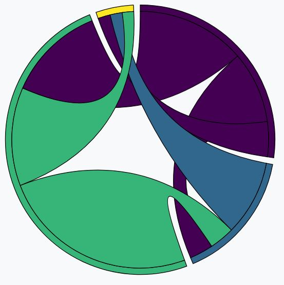
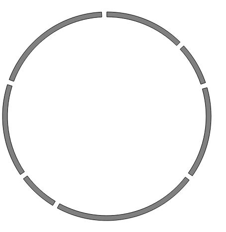
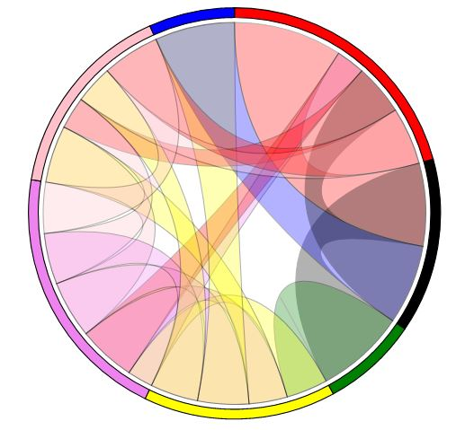
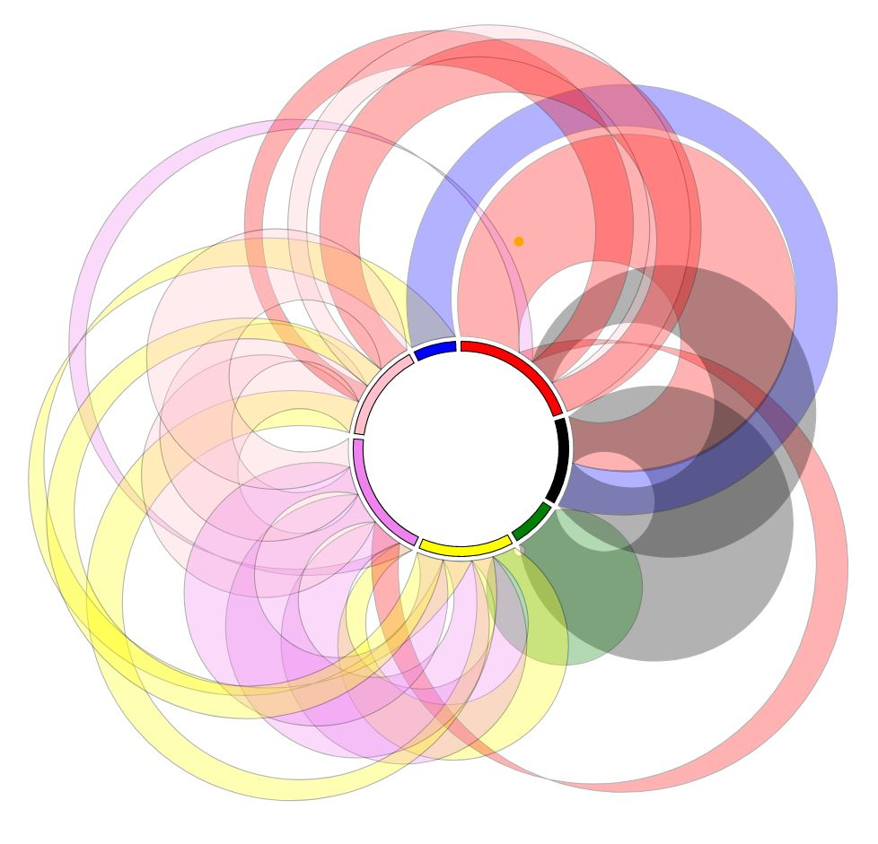
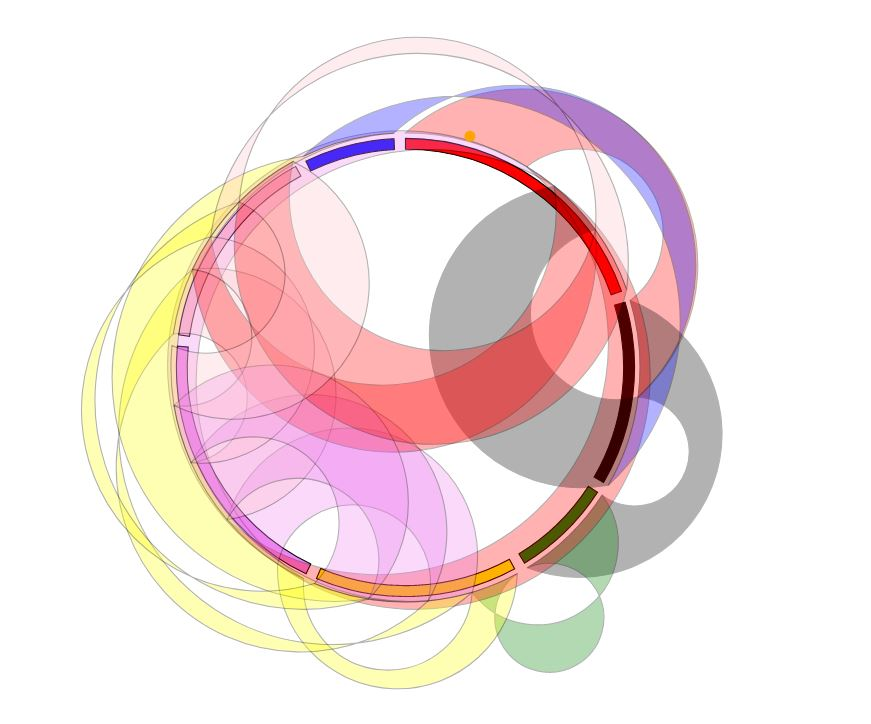
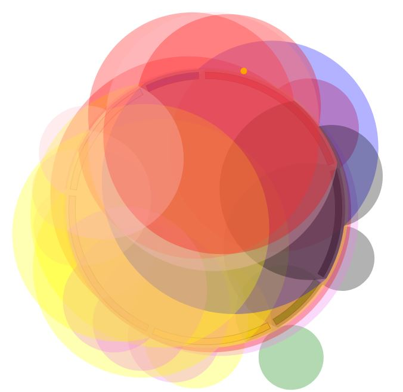

# Showing BTS word distributions in D3 chart
For this project I picked 5 of my favorite BTS songs to show for each the amount of word sung by each member. 

## Preparations
### Data
I searched the internet for the respective song's lyrics which also had some annotations about who is singing the lines. (*No, I cannot determine who is singing only by hearing the song* :grimacing:)

For start my data set will only include:
```
 - title
 - words sum
 - members
    - name
    - words
```

Later information on the sequence of singing will be added.

### The chart
This project is inspired by Nadieh Bremers project ["The Words in the Lord of the Rings"](https://www.visualcinnamon.com/portfolio/words-lord-of-the-rings/) she wrote about in the book *Data Sketches*. She created her own kind of diagram, which based on **Chord diagrams**.

| |||
|:-:|:--:|:-:|
| |A **chord diagram** represents flows or connections between several entities (called nodes). Each entity is represented by a fragment on the outer part of the circular layout. Then, arcs are drawn between each entities. The size of the arc is proportional to the importance of the flow. *[Data-to-Viz](https://www.data-to-viz.com/graph/chord.html)*||

## Step 1 -  Creating the outer ring of the diagram
The buid-in d3.chord() function takes a nxn matrix to restructure the data it in a way, that it can be used for drawing the diagram. In the end there is not a sequence displayed but simple a weighted connection. To just test this I changed the data to look like this:
```
[
    [51, 0, 0, 0, 0, 0, 0],
    [27, 0, 0, 0, 0, 0, 0],
    [58, 0, 0, 0, 0, 0, 0],
    [92, 0, 0, 0, 0, 0, 0],
    [25, 0, 0, 0, 0, 0, 0],
    [59, 0, 0, 0, 0, 0, 0],
    [76, 0, 0, 0, 0, 0, 0]
]
```
Which results in the result I wanted for the first step:

| |||
|:-:|:--:|:-:|
| |Outer ring of the diagram showing the overall distribution of words in a song.||

Underneath d3.chord() only creates a new array, which contains objects storing source and target information:

```
{
  {
    "source": {
      "index": 2,
      "startAngle": 1.2927537473196078,
      "endAngle": 2.1796732004547006,
      "value": 58
    },
    "target": {
      "index": 0,
      "startAngle": 0.7798774501705127,
      "endAngle": 0.7798774501705127,
      "value": 0
    }
  },
  ...
  "groups": {
    "index": 0,
    "startAngle": 1.2927537473196078,
    "endAngle": 2.1796732004547006,
    "value": 58
  }
}

```
This array is used to draw the diagram. 

**Conclusion:** After realizing that the original `d3.chords()` only takes a matrix to draw the chord I decided to adjust the function to use the data structure similar to what I had in mind from in the beginning.

# Step 2 - Adjusting `d3.chords()` and drawing the basic diagram

After rewriting the `d3.chords()` I get a pretty good but still confusing result:

| |||
|:-:|:--:|:-:|
| |Basic chord diagram drawn with new chord function.||

But the data structure that is accepted now is mach easier to  create. Now it takes an array with the sequence.

```
"Sequence": [
            {
                "Name": "Junkook",
                "Words": 34
            },
            {
                "Name": "Suga",
                "Words": 26
            },
            {
                "Name": "RM",
                "Words": 28
            },
           ...
        ] 
```

 The produced output looks generally the same as before.

**Later Steps to be concidered:** It still needs adjustment for the case, that two or more people are singing one passage (that will probably also need adjustment in `d3.ribbon()`). 

### Step 2.5
I created a temporary marker for the starting point (the section where the song starts). In the `new_chord.js` library I added a flag to the data regarding if a entry is start-/ endpoint. But drawing the marker was not as simple as expected due to some DOM-element complcations. **So remember, always know your DOM-element structure (and/or stop thinking too complicated)!**

In the end I used some the `lodash` library to **filter** the one element from the data that has the start flag set to true.

## Step 3: Adjusting `d3.ribbon()`

Since drawing the ribbons in the center of the circle looked quite confusing, I decided to change the `d3.ribbon` library so, that draws the connections on the outside.

Basically I changed `d3.ribbon` from using **cubic bezier curves** to using **arcs** for the larger bow of the connection. Important here was to set the **large-arc-flag** and calculate if the **sweep-flag** needed to be set or not. The last one would determine the direction in which the arc is drawn.

The **radius** would for now just be set to the distance between the endpoints. But is not the optimal solution yet.

| |||
|:-:|:--:|:-:|
| |The new ribbon setup.||

Until that result was achieved some weird mistakes happened:
|||
|:--:|:-:|
|When not setting the **sweep-flag** right this happens.| When only one of the **sweep-flags** is set right. (But it looks very fancy.) |

## References
- [Data: Black Swan Lyrics](https://colorcodedlyrics.com/2020/01/bts-bangtansonyeondan-black-swan)
- Bremer, N. & Wu, S. (2021): Data Sketches
- [D3 Chord diagrams](https://www.d3-graph-gallery.com/chord)
- [Chord diagrams in general](https://www.data-to-viz.com/graph/chord.html)
- [Arcs - large-arc-flag & sweep-flag](https://www.w3.org/TR/SVG/paths.html)
