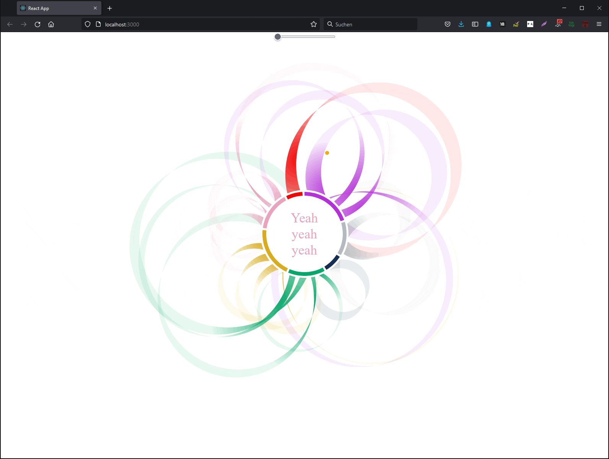

# Showing BTS word distributions in D3 chart
For this project one of my favorite BTS songs to show the amount of word sung by each member. 

## Preparing the data
I searched the internet for the song lyrics which also had marks about who is singing the lines. (*No, I cannot determine who is singing only by hearing the song* :grimacing:).

These data still need to be entered into the `data.json` file:

``` json
  "Song": "Black Swan",
  "WordSum": 378,
  "Sequence": [
    {
      "Name": "Junkook",
      "Words": 34,
      "Lines": [
        {
          "Text": "Do your thang",
          "Start": 0.13,
          "End": 0.14
        },
        {
          "Text": "Do your thang with me now",
          "Start": 0.14,
          "End": 0.16
        },
        ...
      ]
    },
    {
      "Name": "Suga",
      "Words": 26,
      "Lines": [
        {
          "Text": "Ayy",
          "Start": 0.26,
          "End": 0.27
        },
        {
          "Text": "심장이 뛰지 않는대",
          "Start": 0.27,
          "End": 0.29
        },
        ...
      ]
    },
    ...
  ]
```

##  Inspiration
This project is inspired by Nadieh Bremers project ["The Words in the Lord of the Rings"](https://www.visualcinnamon.com/portfolio/words-lord-of-the-rings/) she wrote about in the book *Data Sketches*. For her specific use case she designed a new diagram type, which bases on **Chord diagrams**.

| |||
|:-:|:--:|:-:|
| |A **chord diagram** represents flows or connections between several entities (called nodes). Each entity is represented by a fragment on the outer part of the circular layout. Then, arcs are drawn between each entities. The size of the arc is proportional to the importance of the flow. *[Data-to-Viz](https://www.data-to-viz.com/graph/chord.html)*||

## Development process
The buid-in d3.chord() function takes a *n* x *n* matrix to restructure the data it in a way, that it can be used for drawing the diagram. In the end there is not a sequence displayed (as I needed it) but simply a weighted connection. I had to change the code a bit to fit my need.

| |||||
|:-:|:--:|:-:|:--:|:-:|
| |Outer ring of the diagram showing the overall distribution of words in a song. Each section represents a singer.|| Basic chord diagram drawn with new chord function - After rewriting the `d3.chords()` I get a pretty good but still confusing result.||


| ||| 
|:-:|:--:|:-:|
| |Since drawing the ribbons in the center of the circle looked quite confusing, I decided to change the `d3.ribbon` library so, that draws the connections on the outside. The new ribbon setup. Basically I changed `d3.ribbon` from using **cubic bezier curves** to using **arcs** for the larger bow of the connection. Important here was to set the **large-arc-flag** and calculate if the **sweep-flag** needed to be set or not. The last one would determine the direction in which the arc is drawn. The **radius** would for now just be set to the distance between the endpoints. But is not the optimal solution yet.||

| ||| 
|:-:|:--:|:-:|
| |The  goal is to show the right song text lines while the song is played. As basic setup I added the timestamps for each line to the data and implemented a slider to simulate the played song. There is still an issue with the text fitting into the diagram that needs to be solved in the future. ||

## Weird/ funny/ beautiful mistakes on the way:
|||
|:--:|:-:|
|When not setting the **sweep-flag** right this happens.| When only one of the **sweep-flags** is set right. (But it looks very fancy.) |


## References
- [Data: Black Swan Lyrics](https://colorcodedlyrics.com/2020/01/bts-bangtansonyeondan-black-swan)
- Bremer, N. & Wu, S. (2021): Data Sketches
- [D3 Chord diagrams](https://www.d3-graph-gallery.com/chord)
- [Chord diagrams in general](https://www.data-to-viz.com/graph/chord.html)
- [Arcs - large-arc-flag & sweep-flag](https://www.w3.org/TR/SVG/paths.html)

**Later Steps to be concidered:** 
- It still needs adjustment for the case, that two or more people are singing one passage (that will probably also need adjustment in `d3.ribbon()`). 